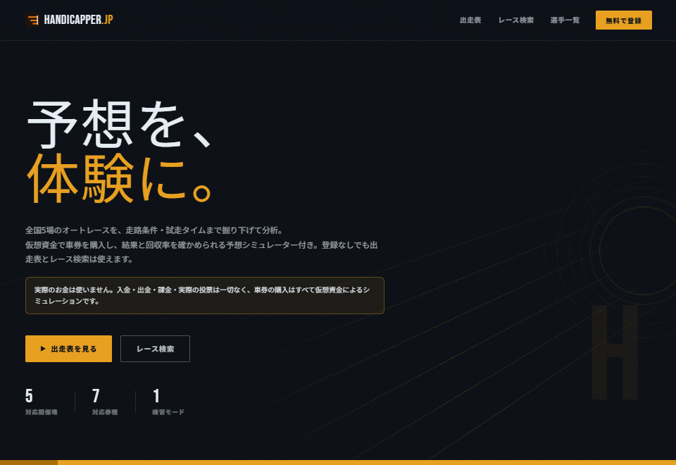

# ポートフォリオ

Web 版（shimomo.net）にだけ載せる「作ったもの」の一覧です。送付用の正本である resume.md には含めません。
「## 見出し」でグループ、「### 見出し」と表で 1 件を書きます。表の行は 説明 / 補足 / 画像 / リンク / バッジ / タグ で、説明以外は省略できます。
画像の行があるカードは横幅いっぱいの大きなカードになります（画像は index.html と同じ場所からの相対パス）。

## 運営中のサービス

### Handicapper.jp

| 項目 | 内容 |
| --- | --- |
| 説明 | オートレースの出走表を走路条件・試走タイム・直近成績まで掘り下げて分析できる Web サービス。全国 5 場の出走表・結果・オッズ・選手情報を日次で収集し、2005 年以降・約 12.9 万レースの確定結果を多条件で検索できます。仮想資金の予想シミュレーターで、予想の結果と回収率を確かめられます。 |
| 補足 | 企画・設計・実装・運用のすべてを一人で担当し、2026 年からシン VPS で稼働中。バッチの失敗やデータの欠落は DB とログ側から検知して Slack へ通知し、cron の停止は healthchecks.io で検知。GitHub Actions で CI と依存パッケージの監査を回しています。 |
| 画像 |  |
| リンク | [サイト](https://handicapper.jp/) |
| バッジ |  |
| タグ | PHP 8.4, Laravel, Vue 3, TypeScript, Inertia.js, Tailwind CSS, MariaDB, PHPUnit, Playwright, GitHub Actions, VPS |

### オートレース.jp

| 項目 | 内容 |
| --- | --- |
| 説明 | Handicapper.jp の姉妹サイト。同じデータを使った検証記事を公開するデータ分析メディアです。結論と数字を先に出し、母数・前提・確かめられなかったことまで含めて書く方針で運営しています。 |
| 補足 | 原稿は Markdown と frontmatter で管理し、HTML への変換・投稿・OGP 画像の生成をスクリプト化。WordPress の子テーマを自作し、さくらのレンタルサーバで運用しています。 |
| リンク | [サイト](https://xn--kck4a5byi2cc.jp/) |
| タグ | WordPress, PHP, Markdown, さくらのレンタルサーバ |

## OSS・公開 API

### boatrace/*

| 項目 | 内容 |
| --- | --- |
| 説明 | ボートレースのデータ取得ライブラリ群。契約（types）・DI コンテナ（core）・汎用モジュール（support）・スクレイパー（scraper / scraper-boatcast）を個別パッケージに分割し、モノレポからリリースして Packagist で公開しています。 |
| リンク | [GitHub](https://github.com/shimomo/boatrace) / [Packagist](https://packagist.org/packages/boatrace/scraper) |
| バッジ |   |
| タグ | PHP, PHPUnit, Psalm, GitHub Actions, Packagist |

### Boatrace Open API

| 項目 | 内容 |
| --- | --- |
| 説明 | 全 24 場の出走表・直前情報・結果を JSON で公開する非公式 API。GitHub Actions で約 3 分ごとに更新し、GitHub Pages で配信しているので、サーバーを持たずに運用できています。 |
| リンク | [API](https://boatraceopenapi.github.io/api/) / [GitHub](https://github.com/boatraceopenapi/api) |
| バッジ |   |
| タグ | PHP, GitHub Actions, GitHub Pages |

### Turnmark API

| 項目 | 内容 |
| --- | --- |
| 説明 | Boatrace Open API の姉妹版。オッズを含めた前日までのデータを提供する、安定重視の API です。 |
| リンク | [GitHub](https://github.com/turnmark/api) |
| バッジ |   |
| タグ | PHP, GitHub Actions, GitHub Pages |

### Tenjisagi（展示詐欺）

| 項目 | 内容 |
| --- | --- |
| 説明 | スタート展示で見せた進入コースと本番の進入コースがどれだけ食い違うかを、選手ごとに数値化したランキング。自作 API のデータから生成し、素の HTML / CSS / JS だけで公開しています。 |
| リンク | [サイト](https://boatracevibeproject.github.io/tenjisagi/) / [GitHub](https://github.com/boatracevibeproject/tenjisagi) |
| バッジ |  |
| タグ | PHP, GitHub Actions, GitHub Pages |

### Narikiri

| 項目 | 内容 |
| --- | --- |
| 説明 | ngrok を起動するたびに変わる URL を Stripe の Webhook エンドポイントへ同期する CLI。Homebrew で配布しています。 |
| リンク | [GitHub](https://github.com/shimomo/narikiri) |
| バッジ |  |
| タグ | Go, Stripe, Homebrew |

### Tokyo Sports Scraper

| 項目 | 内容 |
| --- | --- |
| 説明 | 東京スポーツのオートレース情報を取得する Python ライブラリ。PyPI で公開しています。 |
| リンク | [GitHub](https://github.com/autorace/tokyo-sports-scraper) / [PyPI](https://pypi.org/project/autorace-tokyo-sports-scraper/) |
| バッジ |  |
| タグ | Python, pytest, PyPI |
